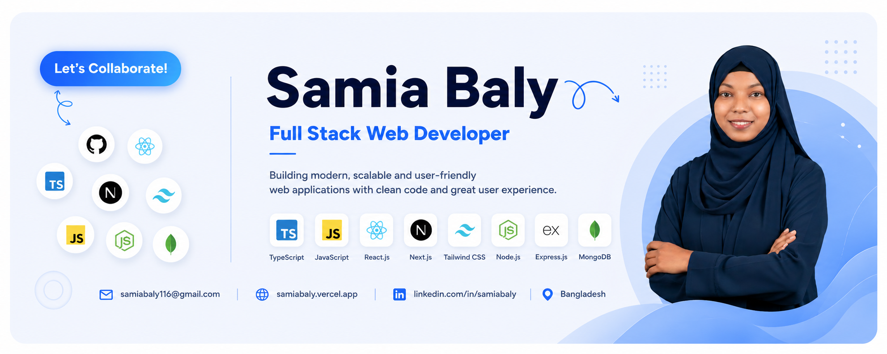

<h1 align="center">Hi 👋, I'm Samia Baly</h1>

  

  
  
  

---

### About Me
I'm a passionate **Full Stack Web Developer** with experience in building responsive and dynamic web applications. I love turning ideas into real products using **React.js**, **Tailwind CSS**, **JavaScript**, and **Node.js**.  

- 🔭 I’m currently working on my personal projects and exploring **Next.js**  
- 🌱 I’m learning **TypeScript** and advanced **React patterns**  
- 💬 Ask me about **JavaScript, React, Tailwind, and web development**  
- ⚡ Fun fact: I love solving problems and coding challenges  

---

### Skills
**Languages & Frameworks:** JavaScript, HTML5, CSS3, React.js, Node.js  
**Styling & UI:** Tailwind CSS, DaisyUI, Material UI  
**Tools & Platforms:** Git, GitHub, VS Code, Vercel, Netlify  

---

### GitHub Stats

  

